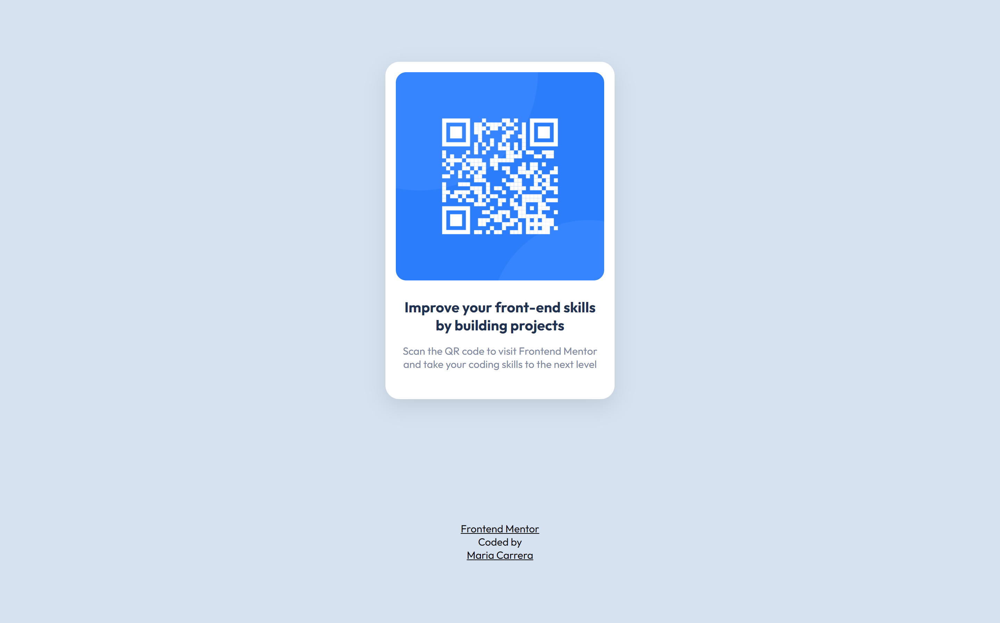

# Frontend Mentor - QR code component solution

This is a solution to the [QR code component challenge on Frontend Mentor](https://www.frontendmentor.io/challenges/qr-code-component-iux_sIO_H). Frontend Mentor challenges help you improve your coding skills by building realistic projects.

## Table of contents

- [Overview](#overview)
  - [Screenshot](#screenshot)
  - [Links](#links)
- [My process](#my-process)
  - [Built with](#built-with)
  - [What I learned](#what-i-learned)
  - [Continued development](#continued-development)
- [Author](#author)
- [Acknowledgments](#acknowledgments)

## Overview

### Screenshot

### Links

- Solution URL: [github.com/MarieCourse/FM-qr-code-component](https://github.com/MarieCourse/FM-qr-code-component)
- Live Site URL: [mariecourse.github.io/FM-qr-code-component/](https://mariecourse.github.io/FM-qr-code-component/)

## My process

### Built with

- Semantic HTML5 markup
- CSS custom properties
- Flexbox
- Desktop-first workflow

### What I learned

This challenge gave me my first approach to Frontend Mastery and allowed me to review certain knowledge I acquired during my web development studies.

### Continued development

For the next projects, I aim to work with basic JavaScript and React

## Author

- Website - [Maria Carrera](https://mariecourse.github.io/portfolio/)
- Frontend Mentor - [@MarieCourse](https://www.frontendmentor.io/profile/MarieCourse)
